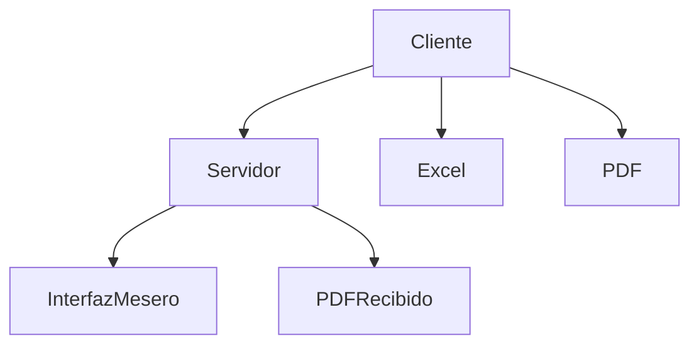

# Documentación del Sistema de Pedidos para **M&M Food & Drink**

Este sistema permite gestionar pedidos en un restaurante mediante una aplicación cliente-servidor. El cliente selecciona productos, genera una factura en PDF y la envía al servidor (mesero) para su procesamiento. A continuación, se describe el funcionamiento de cada script.

---

## 1. `cliente.py`  
### **Descripción**  
Este script representa la interfaz del cliente, que permite seleccionar productos de un menú, generar una factura en formato PDF y enviar el pedido al servidor (mesero) para su gestión.

### **Principales Funcionalidades**  

#### **1.1 Menú de Opciones**  
El menú contiene categorías de productos como:  
- **Salchipapas**  
- **Perros Calientes**  
- **Hamburguesas**  
- **Bebidas**  

Cada categoría tiene productos con precios predefinidos.

#### **1.2 Selección y Resumen de Pedido**  
- **Agregar/Quitar productos**:  
  Se permite al usuario agregar o quitar productos del pedido usando botones de `+` y `-`.  
- **Resumen**:  
  Se muestra un resumen del pedido con el subtotal y el total acumulado.

#### **1.3 Generación de Factura (PDF)**  
- **Librería**: Se usa `ReportLab` para generar una factura en formato PDF.  
- **Contenido**: La factura incluye:  
  - Nombre del cliente.  
  - Fecha del pedido.  
  - Tabla con detalles del pedido (producto, cantidad, precio unitario, subtotal).  
  - Total general.

#### **1.4 Guardar Pedido en Excel**  
- **Librería**: Se utiliza `openpyxl`.  
- **Contenido**: Los pedidos se guardan en un archivo `pedidos.xlsx` con columnas como:  
  - Fecha.  
  - Cliente.  
  - Producto.  
  - Categoría.  
  - Cantidad.  
  - Precio Unitario.  
  - Subtotal y Total.

#### **1.5 Envío de Pedido al Servidor**  
- **Conexión**: Se establece una conexión mediante sockets con el servidor (`mesero.py`).  
- **Datos enviados**:  
  - El pedido en formato JSON.  
  - El archivo PDF generado (en formato binario).

---

## 2. `mesero.py`  
### **Descripción**  
Este script representa el servidor que recibe los pedidos enviados por los clientes. Procesa los datos y muestra los pedidos en una interfaz gráfica para el mesero.

### **Principales Funcionalidades**  

#### **2.1 Servidor Socket**  
- **Conexión**: Escucha en el puerto `8080` y acepta conexiones de múltiples clientes.  
- **Manejo de pedidos**:  
  - Recibe los datos del pedido (JSON) y el archivo PDF.  
  - Guarda el PDF con un nombre único.  
  - Envía una respuesta al cliente confirmando la recepción.

#### **2.2 Gestión de Pedidos**  
- Los pedidos recibidos se agregan a una cola y se muestran en la interfaz del mesero en tiempo real.

#### **2.3 Interfaz del Mesero**  
- **Elementos**:  
  - **Lista de pedidos**: Muestra los pedidos pendientes con detalles como número de pedido, nombre del cliente y el total.  
  - **Notificaciones**: El mesero recibe notificaciones cuando hay nuevos pedidos.  
- **Estilo**: La interfaz usa un tema oscuro con elementos visuales resaltados para mejorar la legibilidad.

---

## 3. **Diagrama de Flujo del Sistema**



---

## 4. **Resumen Técnico**  

- **Cliente**:  
  - Framework: `Flet` para la interfaz.  
  - Librerías: `ReportLab`, `openpyxl`, `socket`, `json`.

- **Servidor**:  
  - Framework: `Flet` para la interfaz del mesero.  
  - Librerías: `socket`, `json`, `threading`.

---

## 5. **Ejecución del Sistema**  

### **Cliente (`cliente.py`)**  
1. Ejecuta el script `cliente.py`.  
2. Interactúa con la interfaz para seleccionar productos y enviar el pedido.

### **Servidor (`mesero.py`)**  
1. Ejecuta el script `mesero.py`.  
2. El servidor espera conexiones y muestra los pedidos en tiempo real.


# Requisitos de Instalación para el Sistema de Pedidos

A continuación, se detallan las librerías y herramientas necesarias para ejecutar los scripts `cliente.py` y `mesero.py`.

---

## 1. **Python**  
Asegúrate de tener instalado **Python 3.12.6** o una versión compatible. Puedes verificar tu versión de Python ejecutando:

```bash
python --version
```

Si no lo tienes instalado, descárgalo desde la [página oficial de Python](https://www.python.org/downloads/).

---

## 2. **Instalación de Dependencias**

Usa el siguiente comando para instalar las librerías necesarias:

```bash
pip install flet reportlab openpyxl
```

### **Detalle de Librerías:**

- **Flet**: Para crear las interfaces gráficas tanto del cliente como del servidor (mesero).  
  - Documentación: [Flet](https://flet.dev/)
  
- **ReportLab**: Para la generación de facturas en formato PDF.  
  - Documentación: [ReportLab](https://www.reportlab.com/docs/reportlab-userguide.pdf)

- **OpenPyXL**: Para guardar los pedidos en formato Excel.  
  - Documentación: [OpenPyXL](https://openpyxl.readthedocs.io/en/stable/)

---

## 3. **Opcional: Virtual Environment (Recomendado)**

Para evitar conflictos con otras dependencias, es recomendable usar un entorno virtual:

```bash
python -m venv env
source env/bin/activate  # Linux/macOS
env\Scripts\activate     # Windows
```

Luego, instala las dependencias dentro del entorno virtual:

```bash
pip install flet reportlab openpyxl
```
